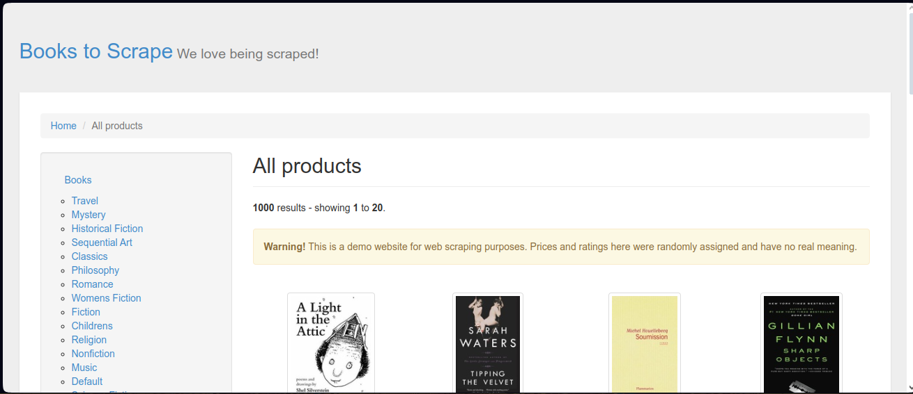
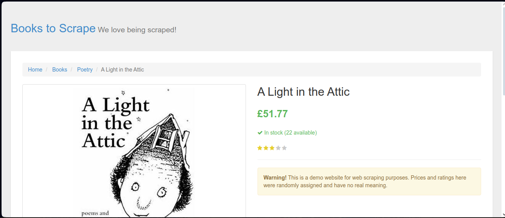
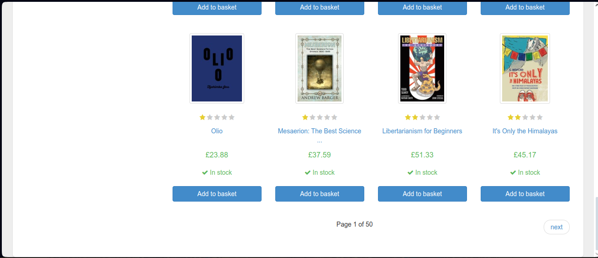

# Preencher Input

# Sumário

- [Preencher Input](#preencher-input)
- [Sumário](#sumário)
  - [Instalação](#instalação)
  - [Código da aplicação](#código-da-aplicação)
  - [Resultado](#resultado)

## Instalação

Para inicializar o programa para teste, é necessário instalar os pré-requisitos contidos no `package.json`. Para instalá-los, basta abrir o terminal na pasta do arquivo e executar:

```bash
npm install
```

> No shell é nessesario estar no diretorio do projeto

> [!IMPORTANT]
> Lembre-se de ja ter feito as intruções contidas no [README](../README.md) principal

## Código da aplicação

O objetivo deste programa é obter dados de livros contidos no site e colocá-los em um arquivo JSON.

## Resultado

O código acessará o link [https://books.toscrape.com/catalogue/page-1.html](https://books.toscrape.com/catalogue/page-1.html) e capturará a quantidade de páginas e a quantidade de linhas na página.



Em seguida, ele acessará a página de cada livro individualmente.



E seguirá nesse processo até acabar os livros da página, fazendo com que o código clique no botão "next" e repita todo o processo anterior até que acabe as páginas.



Por fim, o código gerará um arquivo `json` com todos os dados dos livros.
