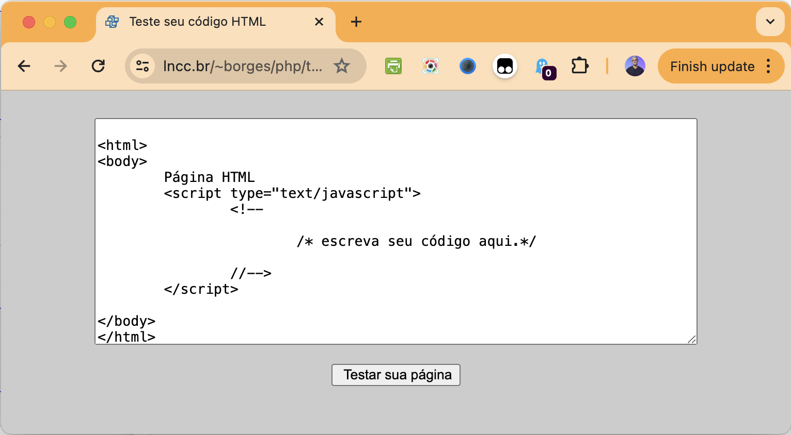
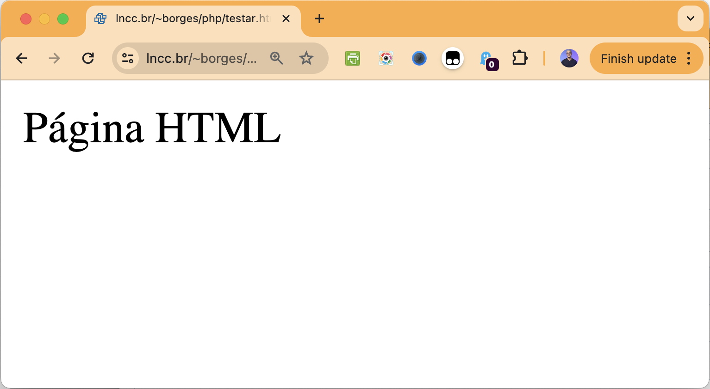

# Interagindo com uma página

# Sumário

- [Interagindo com uma página](#interagindo-com-uma-página)
- [Sumário](#sumário)
  - [Instalação](#instalação)
  - [Código da aplicação](#código-da-aplicação)
  - [Resultado](#resultado)

## Instalação

Para inicializar o programa para teste, é necessário instalar os pré-requisitos contidos no `package.json`. Para instalá-los, basta abrir o terminal na pasta do arquivo e executar:

```bash
npm install
```

> No shell é nessesario estar no diretorio do projeto

> [!IMPORTANT]
> Lembre-se de ja ter feito as intruções contidas no [README](../README.md) principal

## Código da aplicação

Este é o código do laboratório em que fazemos uma interação com a página por meio do clique em um botão qualquer.

Para a interação, utilizamos o método `page.waitForSelector` para capturar o elemento relacionado ao botão. Em seguida, executamos o método `click` nesse elemento.

```JavaScript
const puppeteer = require('puppeteer');

async function clicarBotao() {
    const browser = await puppeteer.launch({ timeout: 1000, headless: false });
    const page = await browser.newPage();
    await page.goto('https://www.lncc.br/~borges/php/testar.html', { waitUntil: ['networkidle0', 'domcontentloaded'], timeout: 10000 });
    const element = await page.waitForSelector('body > center > form > input[type=button]');
    await element.click();
    await browser.close();
}

clicarBotao();
```

## Resultado

O objetivo deste programa é utilizar o Puppeteer para acessar uma página, capturar uma imagem inicial, clicar em um botão e, em seguida, capturar uma nova imagem da tela para evidenciar a mudança.

A página de testes a ser utilizada é a seguite [https://www.lncc.br/~borges/php/testar.html](https://www.lncc.br/~borges/php/testar.html), que exibe a imagem abaixo.



Ao clicar no botão o usuário é redirecionado para uma tela com a seguinte visualização:


