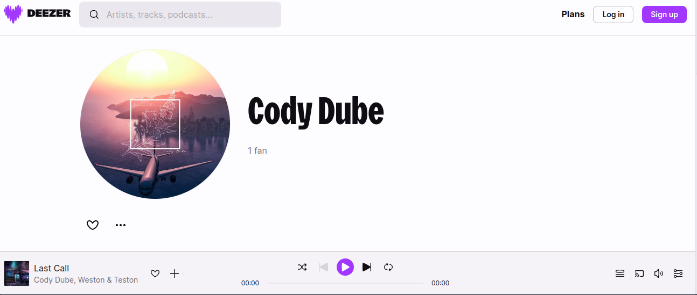
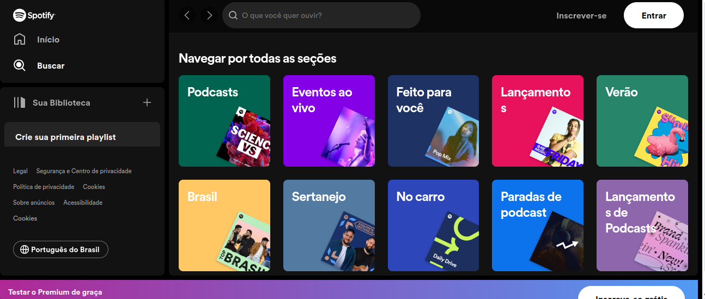
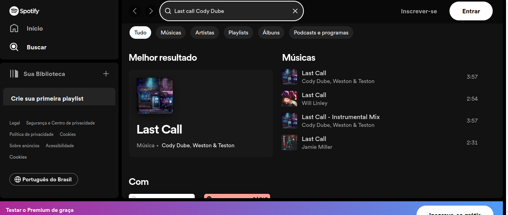
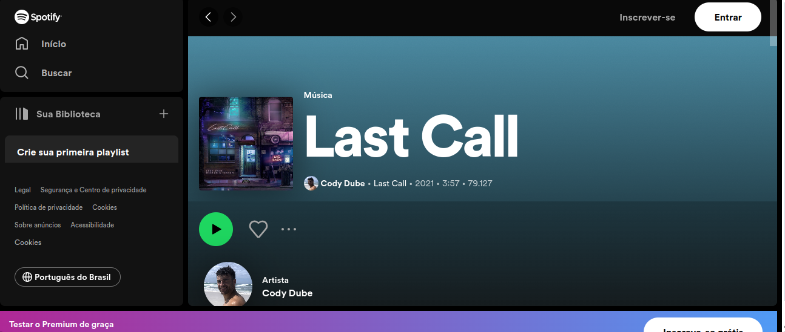

# Comversor de musica

# Sumário

- [Comversor de musica](#comversor-de-musica)
- [Sumário](#sumário)
  - [Instalação](#instalação)
  - [Código da aplicação](#código-da-aplicação)
  - [Resultado](#resultado)

## Instalação

Para inicializar o programa para teste, é necessário instalar os pré-requisitos contidos no `package.json`. Para instalá-los, basta abrir o terminal na pasta do arquivo e executar:

```bash
npm install
```

> No shell é nessesario estar no diretorio do projeto

> [!IMPORTANT]
> Lembre-se de ja ter feito as intruções contidas no [README](../README.md) principal

## Código da aplicação

O objetivo deste programa é criar um conversor no qual você insere um link do Deezer, e o programa retorna um link da música no Spotify.

A captura do nome da música e de sua autoria é feita pela função `page.evaluate`.

```js
const puppeteer = require("puppeteer");
const url = 'https://deezer.page.link/BxLUVpTUCEUSH3oz9'

async function getDadosMusica() {
  const browser = await puppeteer.launch({ timeout: 1000, headless: false });
  const page = await browser.newPage();

  await page.goto(url, { waitUntil: ['networkidle0', 'domcontentloaded'], timeout: 0 });
  await page.click("#gdpr-btn-refuse-all")


  const Nome = await page.evaluate(() => {
    const NomeMusicaElement = document.querySelector("#page_naboo_track > div.catalog-content > div > div.css-1xh3s9i > div > h2");
    return NomeMusicaElement ? NomeMusicaElement.textContent.trim() : null
  });
  await page.click("#page_naboo_track > div.catalog-content > div > div.css-1xh3s9i > div.css-l74hec > div > div > span:nth-child(1) > a")

  await page.waitForNetworkIdle({concurrency: 5, idleTime:2000})
  const Autor = await page.evaluate(() => {
    const Autor = document.querySelector("#page_naboo_artist > div.container.css-0 > div.css-1xh3s9i > div.qmFln.css-l74hec > h2");
    return Autor ? Autor.textContent.trim() : null
  })

  await page.goto("https://open.spotify.com/search")
  await page.locator("#main > div > div.ZQftYELq0aOsg6tPbVbV > div.jEMA2gVoLgPQqAFrPhFw > header > div.rovbQsmAS_mwvpKHaVhQ > div > div > form > input").fill(Nome + " " + Autor)
  await page.waitForTimeout(5000);

  const musica = await page.waitForSelector("#searchPage > div > div > section.vKsgiy0W3aHYmZUlwHoQ.QyANtc_r7ff_tqrf5Bvc.Shelf > div.iKwGKEfAfW7Rkx2_Ba4E.Z4InHgCs2uhk0MU93y_a.deJGxfMNXUc8uApEGgoQ.fJTotRs7ANTq1nrBwlqA > div > div > div > div.cofBW8sjoBtMAmzDgqKt > a > div")
  await musica.click()

  const linkSpotfi = page.url()
  console.log(linkSpotfi)

  await browser.close();
}

getDadosMusica();
```

## Resultado

Incialmente vamos para a pagina da musica selecionada e capturamos o nome da musica


Pois vamos para a pagina do autor



A pos conpilamos as informaçoes da musica seguimos para a pagina de pesquisa do spotify



Selecionamos a caixa de pesquisa e escrevemos o nome e autor da musica



Clicamos na musica e seguimos para sua pagina



E apos isso o codigo ira retornar no console a url do spotify
