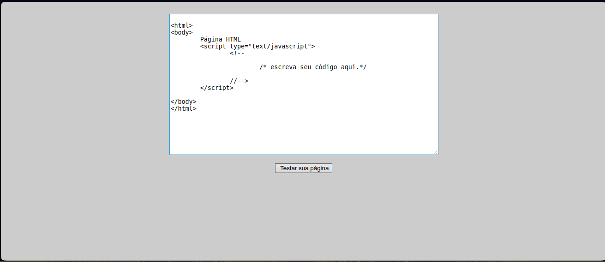

# Preencher Input

# Sumário

- [Preencher Input](#preencher-input)
- [Sumário](#sumário)
  - [Instalação](#instalação)
  - [Código da aplicação](#código-da-aplicação)
  - [Resultado](#resultado)

## Instalação

Para inicializar o programa de teste, é necessário instalar os pré-requisitos contidos no `package.json`. Para instalá-los, basta abrir o terminal na pasta do arquivo e executar:

```bash
npm install
```

> No shell é nessesario estar no diretorio do projeto

> [!IMPORTANT]
> Lembre-se de ja ter feito as intruções contidas no [README](../README.md) principal

## Código da aplicação

O intuito deste programa consiste em obter uma `URL` de uma página, capturar um input e, em seguida, capturar uma captura de tela para representar a mudança.

O prenechimento do input provem do comando `page.locator().fill()`

```js
const puppeteer = require('puppeteer');

async function preencherInput() {
    const browser = await puppeteer.launch({ timeout: 1000, headless: false });
    const page = await browser.newPage();
    await page.goto('https://www.lncc.br/~borges/php/testar.html', { waitUntil: ['networkidle0', 'domcontentloaded'], timeout: 0 });
    await page.locator("body > center > form > textarea").fill('<body> HELLO WORLD</body>');
    const element = await page.waitForSelector('body > center > form > input[type=button]');
    await element.click();
    await browser.close();
}

preencherInput();

```

## Resultado

O codigo vai entar na pagina [https://www.lncc.br/~borges/php/testar.html](https://www.lncc.br/~borges/php/testar.html) e selecionar o input



Apos isso o codigo ira escrever algo no input


E ira clicar no botão que fara seguir para a pagina gerada


