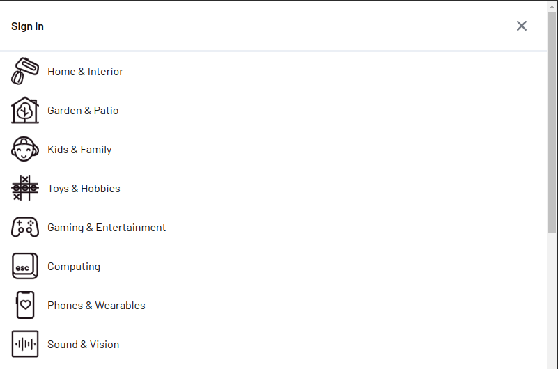
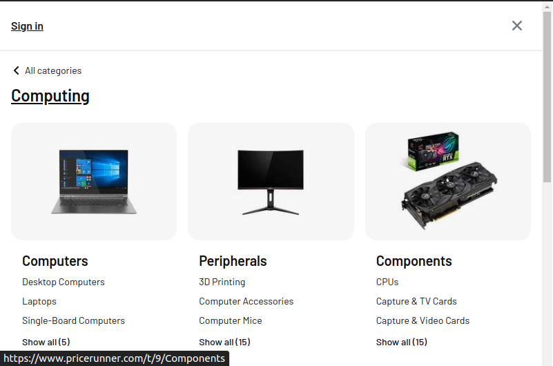
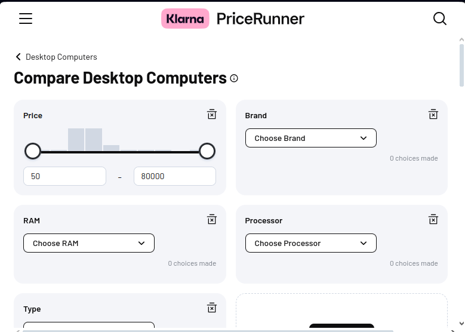
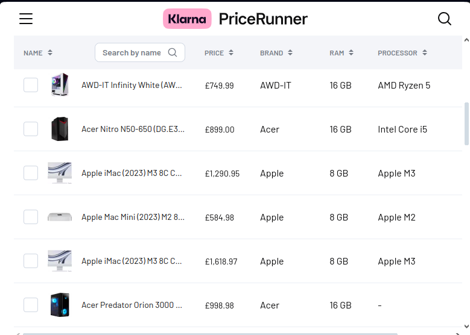

# Preencher Input

# Sumário

- [Preencher Input](#preencher-input)
- [Sumário](#sumário)
  - [Instalação](#instalação)
  - [Código da aplicação](#código-da-aplicação)
  - [Resultado](#resultado)

## Instalação

Para inicializar o programa para teste, é necessário instalar os pré-requisitos contidos no `package.json`. Para instalá-los, basta abrir o terminal na pasta do arquivo e executar:

```bash
npm install
```

> No shell é nessesario estar no diretorio do projeto

> [!IMPORTANT]
> Lembre-se de ja ter feito as intruções contidas no [README](../README.md) principal

## Código da aplicação

O intuito deste programa consiste em obter dados conforme os filtros escolhidos para os produtos e colocá-los em um arquivo JSON e em um CSV.

A captura é feita pela função `page.evaluate`, a transformação de um JSON é feita por meio do `csv.json2csv` e a passagem para arquivo é feita pelo `fs.writeFileSync`.

```js
const puppeteer = require("puppeteer")
const csv = require("json-2-csv")
const fs = require("fs")
const path = require("path")

const pathDoArquivocsv = __dirname + '/' + "data" + '/' + "dados.csv";
const pathDoArquivojason = __dirname + '/' + "data" + '/' + "dados.json";

(async () => {
    const DADOS = await pricesGeter()
    const DADOSjason = JSON.stringify(DADOS, null, 1)
    const DADOScsv = csv.json2csv(DADOS)
    fs.writeFileSync(pathDoArquivocsv, DADOScsv)
    fs.writeFileSync(pathDoArquivojason, DADOSjason)
})()

async function pricesGeter() {
    const browser = await puppeteer.launch({ headless: false })
    const page = await browser.newPage();
    page.goto("https://www.pricerunner.com", { waitUntil: "load" })

    // remover o pop up de cokies
    console.log("aceitando cokies")
    await page.waitForSelector("#onetrust-reject-all-handler")
    await page.click("#onetrust-reject-all-handler")
    await page.waitForNetworkIdle({ idleTime: 200 })

    //entrar na pagina de tags
    console.log("entrando na pagina de tags")
    await page.waitForSelector("#root > div > div.tjPvAEJo9D > div > div > header > div > div > div.VMAMqELTGk > button > span > svg > path")
    await page.click("#root > div > div.tjPvAEJo9D > div > div > header > div > div > div.VMAMqELTGk > button > span > svg > path")

    //selecionar a tag especifica
    console.log("selecionando tag")
    await page.waitForSelector("#root > div > div.tjPvAEJo9D > div.R7g59UjBl2 > div.NEmlGqsAsv.Iq4Dbxjc_w > div > ul > li:nth-child(6) > button > div > svg")
    await page.click("#root > div > div.tjPvAEJo9D > div.R7g59UjBl2 > div.NEmlGqsAsv.Iq4Dbxjc_w > div > ul > li:nth-child(6) > button > div > svg")

    //selecionar sub tag
    console.log("selecionando sub-tag")
    await page.waitForSelector("#root > div > div.tjPvAEJo9D > div.R7g59UjBl2 > div.NEmlGqsAsv.Iq4Dbxjc_w > div > div.pr-6e0dt5 > div:nth-child(1) > div > div > ul > li:nth-child(1) > a")
    await page.click("#root > div > div.tjPvAEJo9D > div.R7g59UjBl2 > div.NEmlGqsAsv.Iq4Dbxjc_w > div > div.pr-6e0dt5 > div:nth-child(1) > div > div > ul > li:nth-child(1) > a")

    //mudança de lista para tabela no modo de exibição
    console.log("pondo no modo de tabela")
    const linkDaPagina = await page.url()
    const linkDaPaginaParaTabela = linkDaPagina.replace("/cl/", "/ct/")
    await page.goto(linkDaPaginaParaTabela, { waitUntil: ['load', "domcontentloaded"] })

    //adição do filtro 
    console.log("adicionando o filtro")
    await page.waitForNetworkIdle({ concurrency: 10, idleTime: 500 })
    await page.waitForSelector("#content-below-header > div > div > div.nuySUOUUKc > div.t16oeg_D3m > div.pr-xcmjqg-Card-root > div > button", { waitUntil: ['load', "domcontentloaded", "networkidle0"] })
    await page.click("#content-below-header > div > div > div.nuySUOUUKc > div.t16oeg_D3m > div.pr-xcmjqg-Card-root > div > button")
    await page.waitForSelector("body > div.pr-1u81w66-BottomSheet-root > div.V43wT_EZgk.ClkEhQjPri.MdWG1IxFgi.pr-8cjuzq-BottomSheet-sheet > div > div.pr-1kyjffm > div:nth-child(2) > ul > li:nth-child(4) > button > label > div > div > div > svg")
    await page.click("body > div.pr-1u81w66-BottomSheet-root > div.V43wT_EZgk.ClkEhQjPri.MdWG1IxFgi.pr-8cjuzq-BottomSheet-sheet > div > div.pr-1kyjffm > div:nth-child(2) > ul > li:nth-child(4) > button > label > div > div > div > svg")
    await page.click("body > div.pr-1u81w66-BottomSheet-root > div.V43wT_EZgk.ClkEhQjPri.MdWG1IxFgi.pr-8cjuzq-BottomSheet-sheet > div > div.pr-1nraity > div.pr-18p7l36 > span > button > span > svg")


    //leitura dos dados
    console.log("iniciando a leitura dos dados")
    let dados = []
    for (let i = 1; i <= 50; i++) {
        const adicaoDeDados = await page.evaluate((i) => {
            const x = {
                nomeDoProduto: document.querySelector(`#content-below-header > div > div > main > div > table > tbody > tr:nth-child(${i}) > td.YrE6t9vcJY.pr-1o2xdvn-TableCell-root > div > a > span`)?.innerText || "-",
                preco: document.querySelector(`#content-below-header > div > div > main > div > table > tbody > tr:nth-child(${i}) > td:nth-child(2) > span`)?.innerText || "-",
                marca: document.querySelector(`#content-below-header > div > div > main > div > table > tbody > tr:nth-child(${i}) > td:nth-child(3)`)?.innerText || "-",
                memoriaRam: document.querySelector(`#content-below-header > div > div > main > div > table > tbody > tr:nth-child(${i}) > td:nth-child(4)`)?.innerText || "-",
                processador: document.querySelector(`#content-below-header > div > div > main > div > table > tbody > tr:nth-child(${i}) > td:nth-child(5)`)?.innerText || "-",
                tipoDeGabinete: document.querySelector(`#content-below-header > div > div > main > div > table > tbody > tr:nth-child(${i}) > td:nth-child(6)`)?.innerText || "-",
                promocao: document.querySelector(`#content-below-header > div > div > main > div > table > tbody > tr:nth-child(${i}) > td:nth-child(7)`)?.innerText || "-"
            }
            return x
        }, i)
        if (i % 3 == 0) {
            await page.waitForNetworkIdle({ concurrency: 8, idleTime: 1000 })
            const existe = await page.waitForSelector(`#content-below-header > div > div > main > div > table > tbody > tr:nth-child(${i})`)
            await existe.scrollIntoView()
        }
        await console.log("lendo: " + i)
        await dados.push(adicaoDeDados)
    }
    await browser.close()
    return dados
}
```

## Resultado

Primeiramente o codigo ira para a seguinte pagina [https://www.pricerunner.com](https://www.pricerunner.com) e clicara nos tres tracinhos


E você sera mandado para a paginase categorias e selecionara computing



Apos isso você sera mandado para a pagina de sub topicos e vai interagir com desktop computers



Então finalmente você sera redirecionado para a pagina de produtos, que sera adicionado o filtro e havera uma alteração na url para mudar do modelo de lista para o modelo de tabela

```
https://www.pricerunner.com/cl/223/Desktop-Computers
para
https://www.pricerunner.com/ct/223/Desktop-Computers
```



E o resultado sera essa tabela de onde sera retirado os dados


